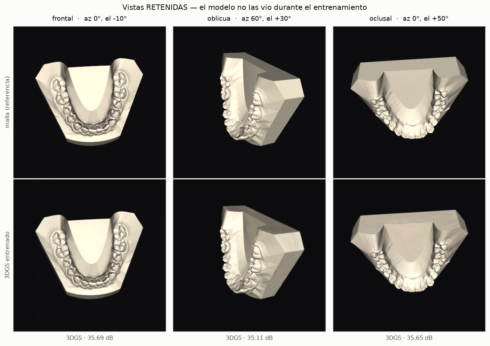
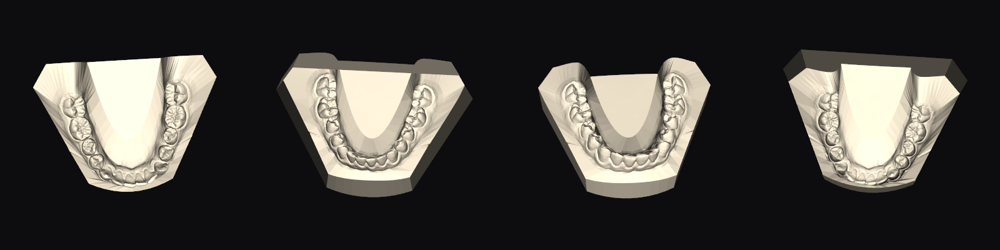
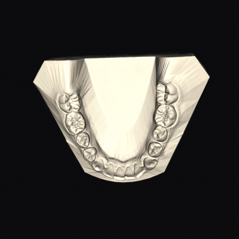
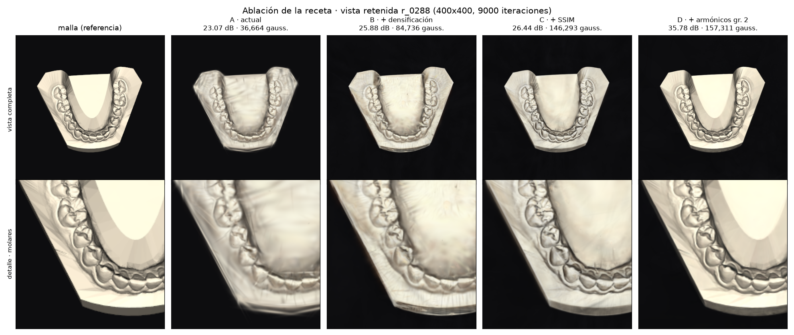
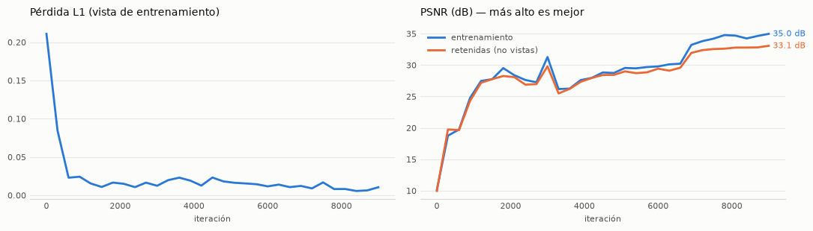

# dental-3dgs-lab

Experimentos de **3D Gaussian Splatting** sobre escaneos intraorales: de la malla
dental (Teeth3DS+) a un campo de gaussianas entrenado, paso a paso y en notebooks.



*Arriba la malla original; abajo el campo de gaussianas, mirado desde tres
ángulos que **no** estaban en el entrenamiento — 35,7 / 35,1 / 35,6 dB de PSNR.*

| Notebook | Qué hace | GPU |
|---|---|---|
| [`01-vtk-3dgs-poc`](notebooks/01-vtk-3dgs-poc.ipynb) | Malla `.obj` + labels FDI → nube de puntos → *splatting* clásico con VTK. Caracteriza los 600 escaneos del dataset. | No |
| [`02-vtk-interactive-viewer`](notebooks/02-vtk-interactive-viewer.ipynb) | Visor 3D interactivo (ventana nativa VTK) para rotar malla, campo y nube. | No |
| [`03-synthetic-views-for-3dgs`](notebooks/03-synthetic-views-for-3dgs.ipynb) | Renderiza vistas sintéticas con **pose de cámara exacta** (sin COLMAP) → `images/`, `transforms.json`, `init.ply`. | No |
| [`04-train-3dgs-gsplat`](notebooks/04-train-3dgs-gsplat.ipynb) | Entrena gaussianas anisótropas con `gsplat` y evalúa **PSNR en vistas retenidas**. | **Sí** |

Detalle de cada uno en [`notebooks/README.md`](notebooks/README.md).

## Del escaneo a las gaussianas

Las vistas de entrenamiento no son fotos: se **renderizan** desde la malla, así
que la pose de cámara es un dato de entrada y no algo que haya que estimar. El
pipeline **no usa COLMAP** en ningún punto — sin *structure-from-motion* no hay
error de pose, y lo que mide el PSNR del 04 es el motor de 3DGS y nada más.

A cambio, esto **no** es un pipeline foto→3D: es una validación con verdad-terreno.
No existe dataset público de fotos dentales multi-vista reales, así que ese caso
queda fuera de alcance — ver [`docs/research/dataset-teeth3ds.md`](docs/research/dataset-teeth3ds.md).



*Cuatro de las 528 vistas que el notebook 03 genera por caso — cada una con su
pose exacta en `transforms.json`.*

Y esto es el resultado: **el campo de gaussianas rasterizado**, recorriendo un
anillo completo de la órbita a elevación +20°.



*48 fotogramas rasterizados con `gsplat` — no es la malla girando, son las
148 167 gaussianas entrenadas vistas desde 48 ángulos. La órbita sale de la
propia rejilla del 03, así que el bucle cierra exacto (§4b del notebook 04).*

## Qué mueve la aguja

Cuatro configuraciones sobre el mismo caso, medidas en la misma vista retenida.
Las produce [`scripts/ablacion_recetas.py`](scripts/ablacion_recetas.py), que
entrena las cuatro y saca la tabla y la figura.
La diferencia entre la primera y la última no es afinar hiperparámetros: es que
sin **armónicos esféricos** el color es plano por gaussiana y el brillo especular
del render de referencia es irreproducible por construcción.



*Fila de arriba, la vista completa; abajo, el mismo detalle ampliado en las
cuatro configuraciones.*

| Configuración | PSNR (media, 66 vistas retenidas) | Gaussianas | Útiles |
|---|---|---|---|
| A · actual | 22,59 dB | 36 664 | 6% |
| B · + densificación | 24,60 dB | 84 736 | 44% |
| C · + SSIM | 23,65 dB | 146 293 | 45% |
| D · + armónicos gr. 2 | **32,64 dB** | 157 311 | 35% |

La tabla da la **media sobre las 66 vistas retenidas**; los pies de la figura, el
PSNR de esa vista concreta — por eso son más altos. Y son una foto fija: la
densificación no es reproducible bit a bit en GPU, así que entre ejecuciones estos
valores bailan ~0,3 dB.



*Las dos curvas de PSNR van juntas y separadas por 1,9 dB (35,0 frente a 33,1).
Que la de vistas retenidas siga a la de entrenamiento en vez de despegarse es la
señal de que el campo reconstruye geometría en lugar de memorizar imágenes.*

## Puesta en marcha

```bash
uv sync                      # entorno de los notebooks 01-03
./scripts/fetch_teeth3ds.sh  # descarga Teeth3DS+ en data/raw (~7,3 GiB; --subset para ~300 MiB)
uv run jupyter notebook
```

`uv run` es necesario para que el kernel use el `.venv` del proyecto; lanzar
`jupyter` a secas usaría el Python del sistema y fallaría con `ModuleNotFoundError`.

El orden es **01 → 03 → 04**: el 04 entrena sobre los paquetes de vistas que
genera el 03. El 02 es independiente y **requiere pantalla** (no corre headless).

### El notebook 04 usa un entorno aparte

`torch` y `gsplat` no están en `pyproject.toml` a propósito: dependen de la GPU y
del CUDA de la máquina, y un `uv sync` los podaría. Se instalan en su propio venv
con su kernel de Jupyter — instrucciones en la §0 del propio notebook.

Validado en **RTX 5070 (sm_120)** con `torch 2.11.0+cu128` y `gsplat 1.5.3`.

La §4b del 04 monta el GIF de la órbita invocando **`ffmpeg`**, que no es un
paquete de Python y hay que tenerlo en el sistema (`sudo pacman -S ffmpeg`,
`apt install ffmpeg`…). Sin él esa celda falla; el resto del notebook no lo usa.

## Estructura

```
notebooks/              los cuatro experimentos, con sus figuras embebidas
packages/core-schemas/  contrato de datos (Pydantic) al que serializan 01 y 04
scripts/                fetch_teeth3ds.sh (dataset) · ablacion_recetas.py (tabla de arriba)
docs/research/          nota del dataset Teeth3DS+
docs/assets/            las figuras de este README (sí versionadas: son documentación)
data/                   gitignored: raw/ es el dataset, processed/ los artefactos
```

`data/` no se versiona: pesa varios GB, es **regenerable** (script + notebooks) y
el dataset no debe redistribuirse por el repo. El repo guarda la receta, no el dato.
Las figuras de `docs/assets/` son la excepción — se copian a mano desde
`data/processed/` porque un README sin imágenes no se lee, y ahí sí compensa el peso.

## Dataset

[Teeth3DS+](https://github.com/abenhamadou/3DTeethSeg_MICCAI_Challenges) (MICCAI
3DTeethSeg'22) — 300 pacientes / 600 escaneos. Licencia **CC-BY 4.0**
(Ben-Hamadou et al., 2022): atribuir en cualquier derivado. Ver
[`docs/research/dataset-teeth3ds.md`](docs/research/dataset-teeth3ds.md).
